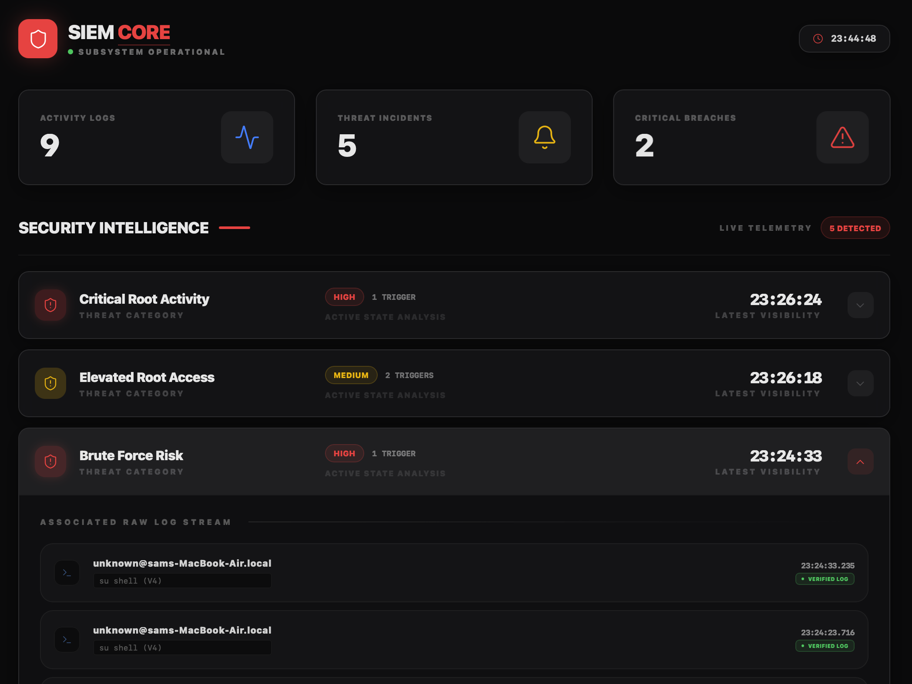

<div align="center">
  
  <h1 align="center">SENTINEL CORE SIEM</h1>
  <p align="center">
    <b>A high-performance, real-time macOS Security Information and Event Management system.</b>
  </p>
</div>

---

<div align="center">
  
</div>

<br />

> **Sentinel Core** acts as an ultra-lightweight, invisible macOS agent that monitors and hooks into the `log stream` utility. It actively parses authentication failures and unexpected root privilege escalations, feeding them down to a Node.js rules engine before visualizing them on a glassmorphic dashboard via sub-second WebSockets.

---

## 🏗️ System Architecture

Sentinel Core is structured into three highly optimized and independent micro-layers:

| Command Module | Stack | Primary Function | Data Pipeline |
| :--- | :--- | :--- | :--- |
| **Collector (`agent`)** | `C` & `libcurl` | Ingests `log stream` natively. | Native OS → JSON HTTP |
| **Engine (`backend`)** | `Node.js` | Parses events & calculates risk thresholds. | HTTP → MongoDB → WS |
| **Interface (`dashboard`)** | `React` + `Tailwind` | Consumes WS securely for live threat UI. | WebSockets → Client UI |

---

## 🧠 Threat Intelligence Engine

The backend engine processes inbound system activity through strict time-window correlation algorithms.

### 🔴 High Severity: Compromise Patterns

| Threat Profile | Trigger Condition | Consequence |
| :--- | :--- | :--- |
| **Brute Force Risk**| `≥ 6 Auth Failures` / `5 min` | Raises an immediate, permanent `High` risk incident. |
| **Confirmed Compromise** | `Auth Failures + Elevate Access` | Correlates a brute force attempt immediately followed by a successful application launch wrapper login (`su`). |

### 🟡 Medium Severity: Reconnaissance

| Threat Profile | Trigger Condition | Status Code |
| :--- | :--- | :--- |
| **Multiple Auth Failures** | `≥ 2 Auth Failures` / `5 min` | `Medium` |
| **Elevated Root Access** | Successful root entry (`su` / `sudo`) | `Medium` |

---

## ⚙️ Deployment & Compilation Guide

### 1. Requirements

Before deploying Sentinel Core, ensure the host environment meets the prerequisites:
- **Environment:** macOS (Utilizes local Unified Log format).
- **Toolchains:** Node.js v18+, NPM, `GCC` compiler.
- **Database:** Local instance of MongoDB (`localhost:27017`).

---

### 2. Ignition Protocol

Open three isolated terminal processes to deploy the full stack. 

#### Step 1: Initialize Database & SIEM Engine
```bash
cd backend
npm install
node server.js
```
*(Confirms MongoDB connection and binds WebSockets on port `3000`)*

#### Step 2: Compile & Launch Log Stream Collector
```bash
cd agent
gcc main.c -lcurl -o agent
./agent
```
*(Executes natively without slowing down OS performance or memory footprint)*

#### Step 3: Deploy Glassmorphic Dashboard
```bash
cd dashboard
npm install
npm run dev
```

---

## 🧪 Simulation Testing

Execute these tests directly in your terminal to see the live WebSocket capabilities in real-time.

<table width="100%">
  <tr>
    <th align="left">Threat Vector</th>
    <th align="left">Attack Sequence</th>
    <th align="center">Expected Severity</th>
  </tr>
  <tr>
    <td><b>Brute Force</b></td>
    <td><code>sudo -k</code><br /><code>sudo ls</code> (Enter wrong password 2 times)</td>
    <td align="center">🟡 <b>Medium</b></td>
  </tr>
  <tr>
    <td><b>Privilege Escalation</b></td>
    <td><code>sudo su</code> (Enter CORRECT password)</td>
    <td align="center">🟡 <b>Medium</b></td>
  </tr>
  <tr>
    <td><b>High-Risk Brute Force</b></td>
    <td><code>sudo ls</code> (Enter wrong password 6 consecutive times)</td>
    <td align="center">🔴 <b>High</b></td>
  </tr>
</table>

---

<div align="center">
  <sub><strong>© Sentinel Core Systems</strong> // Built for Performance. Designed for Security Ops.</sub>
</div>
